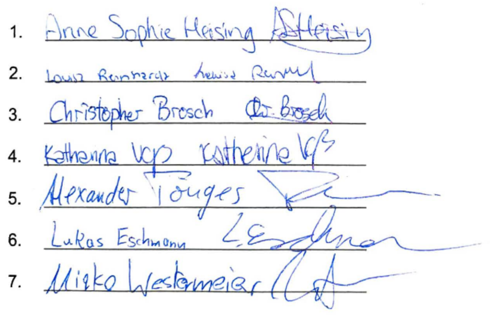

# Satzung der Hochschulgruppe Salsamentaria

**Stand: 15. Januar 2020**

## § 1 Name und Sitz

Die Vereinigung von Mitgliedern der WWU führt den Namen “Salsamentaria”. Sie hat ihren Sitz in Münster.

## § 2 Zweck der Salsamentaria-Hochschulgruppe

Zweck der Salsamentaria-Hochschulgruppe ist die Integration der lateinamerikanischen Salsa-Kultur mit ihrer Musik, ihren Tänzen und ihren sozialen Werten an der Universität Münster. Wir möchten Studierenden den Zugang zu afrokubanischen Tänzen als Kunst, Sport und Freizeitbeschäftigung erleichtern. Wir verstehen die Tänze als Ausdrucksmittel und Sprache, mit denen man über ethnische und nationale Grenzen hinweg mit Anderen kommunizieren kann. Dabei ist uns die Stärkung von Frauen und LGBTQ-Menschen im Tanz und in der Latino-Kultur und der Didaktik der zugehörigen Tänze ein besonderes Anliegen.

An der Universität Münster wirken wir an Kulturveranstaltungen mit und richten eigene aus. Dazu möchten wir uns mit anderen kulturellen und sportlichen Hochschulgruppen vernetzen. Mit Showgruppen möchten wir die Universität Münster tänzerisch auf Veranstaltungen und Wettbewerben repräsentieren.

## § 3 Mitglieder

Ordentliche Mitglieder der Salsamentaria-Hochschulgruppe sind Mitglieder der Universität Münster gem. § 9 Abs. 1 Hochschulgesetz (HG). Ehrenmitglieder, fördernde Mitglieder oder sonstige außerordentliche Mitglieder können auch Personen sein, die nicht Mitglieder der Westfälischen Wilhelms Universität Münster sind.

## § 4 Erwerb und Verlust der Mitgliedschaft

Voraussetzung für den Erwerb der Mitgliedschaft ist ein an den Vorstand zu richtender Aufnahmeantrag, in dem sich Antragsstellende zur Einhaltung der Satzungsbestimmungen verpflichten. Die Mitgliedschaft in der Salsamentaria-Hochschulgruppe endet durch

1. Austritt,
1. Ausschluss oder
1. Tod des Mitglieds.

## § 5 Beiträge

Die Salsamentaria-Hochschulgruppe erhebt keine Beiträge.

## § 6 Organe der Salsamentaria-Hochschulgruppe

Organe der Salsamentaria-Hochschulgruppe sind:

1. der Vorstand,
1. die Mitgliederversammlung.

## § 7 Vorstand

1. Der Vorstand vertritt die Salsamentaria-Hochschulgruppe als gesetzlicher Vertreter nach außen. Er organisiert sie nach innen.
1. Der Vorstand besteht aus einem vorsitzenden Mitglied, zwei beisitzenden Mitgliedern und einer*einem Schatzmeister*in. 
1. Dem Vorsitz obliegt vorrangig die Sitzungsleitung ordentlicher Mitgliederversammlungen.
1. Der*Die Schatzmeister*in ist verantwortlich für die Finanzen der Salsamentaria-Hochschulgruppe. Nach Ablauf seiner*ihrer Legislatur legt er*sie auf der ordentlichen Mitgliederversammlung einen Rechenschaftsbericht vor.
1. Der Vorstand wird von der Mitgliederversammlung für ein Jahr geheim gewählt.
1. Die Amtsperiode des Vorstands endet ein Jahr nach der letzten Vorstandswahl, oder wenn ein neu gewählter Vorstand erstmals zusammentritt. Der Vorstand kann jederzeit durch eine Mehrheit von zwei Dritteln der anwesenden Mitglieder der Mitgliederversammlung gewählt werden.
1. Beschlüsse trifft der Vorstand mit Stimmenmehrheit.
1. Bei Bedarf kann der Vorstand einzelne Aufgaben an ordentliche Mitglieder oder Gremien delegieren.

## § 8 Mitgliederversammlung

1. Die ordentliche Mitgliederversammlung wird durch den Vorstand einberufen. Sie findet mindestens einmal jährlich statt. Die ordentlichen Mitglieder der Salsamentaria-Hochschulgruppe sind unter Bekanntgabe der Tagesordnung mindestens zwei Wochen vor dem Tag der Mitgliederversammlung in Textform einzuladen.
1. Der Vorstand kann im Interesse der Salsamentaria-Hochschulgruppe eine außerordentliche Mitgliederversammlung einberufen. Er ist hierzu verpflichtet, wenn ein Viertel der Mitglieder (aber mindestens drei Mitglieder) dies in Textform unter Angabe des Zwecks und der Gründe verlangt. In diesem Fall sind die Mitglieder unter Bekanntgabe der Tagesordnung mindestens eine Woche vor dem Tag der außerordentlichen Mitgliederversammlung schriftlich einzuladen.

## § 9 Aufgaben der Mitgliederversammlung

Die Angelegenheiten der Salsamentaria-Hochschulgruppe werden, soweit sie nicht vom Vorstand zu besorgen sind, durch Beschlussfassung in der Mitgliederversammlung geregelt.

Die Mitgliederversammlung hat folgende Aufgaben:

1. Entlastung des Vorstands,
1. Wahl des Vorstands,
1. Beschlussfassung über den Ausschluss von Mitgliedern,
1. Beschlussfassung über Satzungsänderungen,
1. Beschlussfassung über die Auflösung der Salsamentaria-Hochschulgruppe,
1. Wahl zweier Kassen- und Rechnungsprüfer*innen.

## § 10 Beschlussfassung der Mitgliederversammlung

1. Die Mitgliederversammlung ist beschlussfähig, wenn mindestens die Hälfte der ordentlichen Mitglieder anwesend ist. Die Beschlussfähigkeit wird nur auf Antrag festgestellt, jedoch nicht rückwirkend. Wird wegen Beschlussunfähigkeit zum selben Tagesordnungspunkt ein zweites Mal eingeladen, so ist die Mitgliederversammlung unabhängig von der Zahl der erschienenen Mitglieder beschlussfähig.
1. Jedes ordentliche Mitglied der Salsamentaria-Hochschulgruppe ist antragsberechtigt. Jedes in der Mitgliederversammlung anwesende ordentliche Mitglied ist stimmberechtigt und hat eine Stimme. Beschlüsse werden mit einfacher Stimmenmehrheit gefasst, soweit gesetzliche Vorschriften oder die Satzung nichts anderes bestimmen. Die Beschlussfassung erfolgt in der Regel in offener Abstimmung, Wahlen sind geheim.
1. Kandidierende sind gewählt, wenn sie die absolute Mehrheit der gültigen Stimmen erhalten. Erhält niemand diese Mehrheit, so findet ein weiterer Wahlgang statt, in welchem die relative Mehrheit entscheidet. Bei Stimmengleichheit entscheidet das Los.
1. Satzungsänderungen oder die Auflösung der Salsamentaria-Hochschulgruppe erfordern eine Mehrheit von drei Vierteln der anwesenden Mitglieder der Mitgliederversammlung. Vorschläge zur Satzungsänderung sind zuvor beim Vorstand einzureichen.

## § 11 Redeliste

Das Rederecht in Mitgliederversammlungen und Vorstandssitzungen wird durch die Sitzungsleitung anhand einer vorrangig quotierten und nachrangig balancierten Redeliste erteilt. Die Redeliste wird mit einem neuen Punkt der Tagesordnung neu eröffnet.

## § 12 Abstimmungen

1. Abstimmungsgegenstände werden durch die Sitzungsleitung formuliert und durch Handzeichen abgestimmt.
1. Anträge gelten als angenommen, wenn ihnen die einfache Mehrheit der Anwesenden zustimmt.
1. Enthält sich die Mehrheit der anwesenden Mitglieder bei einer Abstimmung, kann der Abstimmungsgegenstand durch die Sitzungsleitung präzisiert oder erneut zur Diskussion gestellt werden, bevor erneut darüber abgestimmt wird. Bei erneuter Enthaltungsmehrheit gilt der Antrag als abgelehnt.
1. Auf Antrag eines Mitglieds können Abstimmungen geheim oder namentlich durchgeführt werden. Sollte ein anderes Mitglied gegen den Abstimmungsmodus Widerspruch einlegen, wird darüber per Handzeichen abgestimmt. Spricht sich eine Mehrheit von zwei Dritteln der anwesenden Mitglieder gegen den Antrag aus, ist er abgelehnt.

## § 13 Niederschrift

Über alle Mitgliederversammlungen und Vorstandssitzungen ist eine Niederschrift anzufertigen, die vom vorsitzenden Mitglied und einem beisitzenden Mitglied des Vorstandes zu unterzeichnen ist.

## § 14 Auflösung der Salsamentaria-Hochschulgruppe

1. Die Salsamentaria-Hochschulgruppe kann durch Beschluss der Mitgliederversammlung aufgelöst werden. Zur Auflösung ist die Mehrheit von drei Vierteln der anwesenden Mitglieder erforderlich.
1. Bei Auflösung der Salsamentaria-Hochschulgruppe fällt das Vermögen an den UPLA e.V., den Deutsch-Lateinamerikanischen Verein Münsters. Einzelheiten können mit der Beschlussfassung der Auflösung durch die Mitgliederversammlung festgelegt werden.

## § 15 Inkrafttreten

Die Satzung tritt mit dem Tag ihres Beschlusses in Kraft. Dieser muss auf einer Mitgliederversammlung mit einer Mehrheit von zwei Dritteln der anwesenden Mitglieder erfolgen.

*Datum: 25.02.2020*

Unterschriften von sieben Mitgliedern:

